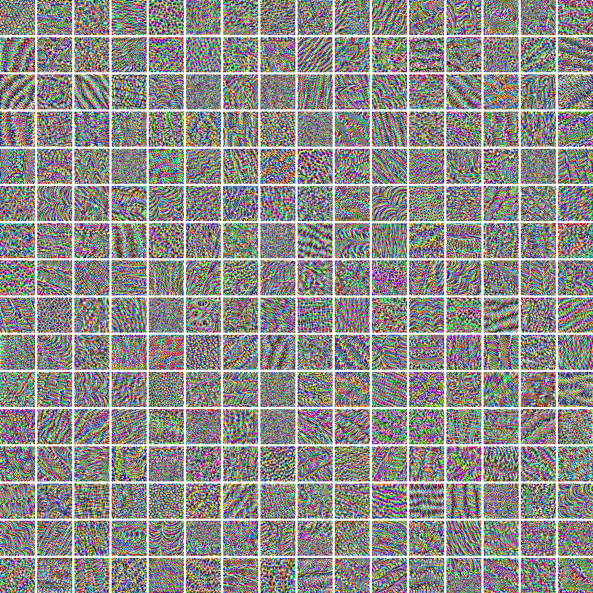
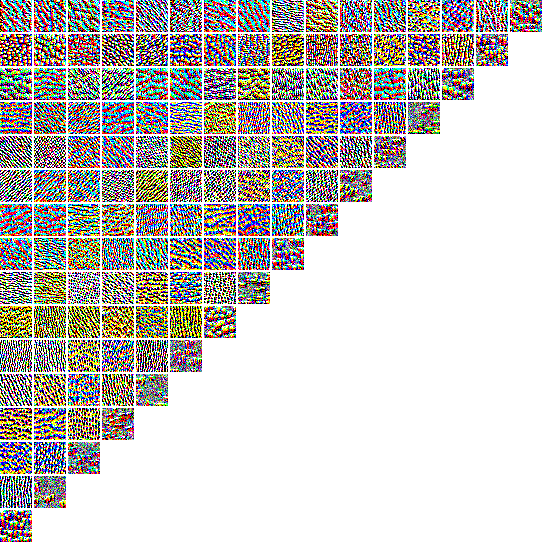

# transband-SARgeneration

**transband-SARgeneration** is a PyTorch-based implementation of a neural style transfer framework tailored for **cross-band PolSAR image generation**, using **backpropagation-based optimization**. This work builds upon the seminal style transfer method proposed by [Gatys et al.](https://ieeexplore.ieee.org/document/7780634), adapting it to the SAR domain to learn meaningful style representations across frequency bands.

<div align="center">
  
</div>

---

## 🔍 Overview

Cross-band generation in PolSAR imagery is a challenging task due to diverse backscattering mechanisms under different frequency bands (e.g., L-band vs. X-band). This project provides a **neural-style-transfer-based approach**, treating cross-band differences as a transformation in style while preserving semantic content.

Key features:

- Neural style transfer framework for PolSAR data
- VGG-based feature extraction (VGG16/VGG19)
- Cross-band generation using style and content loss
- Layer-wise feature visualization to interpret representations

---

## 📁 Repository Structure

```bash

transband-SARgeneration/

├── models/       # Gatys Model + VGG backbone
├── utils/        # Normalization, image saving, scaling tools
├── visualization/ # Code for visualizing style/content features per layer-channel
├── results/      # Output images and intermediate results
├── configs/      # Argument parsing and config settings
├── train.py      # Code for precomputing the Gram matrix of the target band
├── test.py       # Main entrance for cross-band PolSAR image generation
├── requirements.txt
└── README.md

```

---

## 📷 Visualization Results

The `visualization/` module provides interpretability tools for understanding what each layer or channel in the VGG-based network learns.

🔹 **Feature Map (Channel-wise Activation)**
We visualize the **optimized input image** that maximally activates a specific channel of a selected convolutional layer.

- Each feature map corresponds to a particular filter in the network.

- The optimization starts from a random input and adjusts pixel values via backpropagation to maximize the average activation of the chosen channel.

- The result reveals **what pattern or structure the filter is sensitive to**.

<div align="center">
  
</div>

> *(Above: visualization of the feature map corresponding to the 15th layer of VGG16)*

🔹 **Style Representation (Gram Matrix Elements)**

We also provide visualization tools related to **style features**, derived from the **Gram matrix of feature activations**:

- The Gram matrix captures **pairwise correlations between feature maps**, encoding texture and style information.

- A specific element `(i, j)` of the Gram matrix represents the inner product between feature maps of channels `i` and `j`.

- Visualizing the corresponding optimized image helps interpret how style features are formed by co-activations of different filters.

<div align="center">
  
</div>

> *(Above: visualization of style representation corresponding to the 3rd layer of VGG16)*

---

## 🛠️ Dependencies

This project is built on top of [pytorch-CycleGAN-and-pix2pix](https://github.com/junyanz/pytorch-CycleGAN-and-pix2pix).

---

## 🚀 Getting Started

1. **Clone this repo**
    ```bash
    git clone https://github.com/ludw-bj/transband-SARgeneration.git
    cd transband-SARgeneration
    ```

2. **Install dependencies**
    ```bash
    pip install -r requirements.txt
    ```

3. **Prepare your own dataset**
    >  Place images from the two frequency bands into separate folders:
    `[datapath]/A` for domain A (e.g., X-band) and `[datapath]/B` for domain B (e.g., Ka-band).
    > Example `.jpg`-formatted datasets are provided under `./datasets/x2ka/test`.

4. **Calculate the Gram Matrix of the target band**
    The accumulated Gram matrix will be stored in `opt.checkpoint_dir` as a `.pth` file:
    ```bash
    python train.py
    ```

5. **Test the model**
    Generate cross-band PolSAR images with
    ```bash
    python test.py --dataroot ./datasets/x2ka --name x2ka_gatys --model gatys --content_layer 1,3 --style_source total
    ```

6. **Visualization**
    ```bash
    python visualization/ContentVisualization.py
    python visualization/StyleVisualization.py
    ```

🔧 Customize other training and testing parameters as needed. See options/train_options.py and options/test_options.py for full configuration options.

---

## 📄 Citation

If you find this work useful, please consider citing:

```bibtex
@misc{transband-SARgeneration,
  author = {Lu, Danwei},
  title = {transband-SARgeneration},
  year = {2023},
  publisher = {GitHub},
  journal = {GitHub repository},
  howpublished = {\url{https://github.com/ludw-bj/transband-SARgeneration}},
}